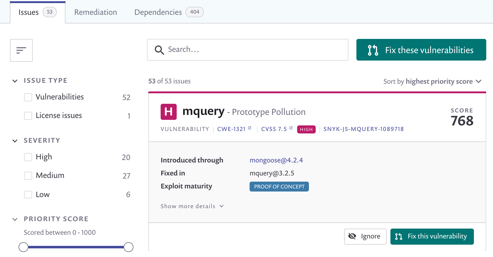
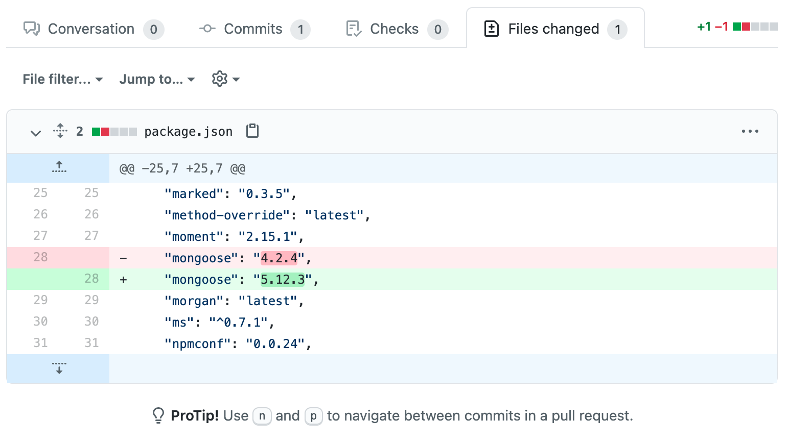

# Getting started with Snyk Open Source

Get started with Snyk Open Source to inspect, find and fix vulnerabilities in your code.


This process describes using the Snyk.io UI and a source code management system.  
You can also use an [IDE tool](https://docs.snyk.io/integrations/ide-tools) or a [CI/CD integration](https://docs.snyk.io/integrations/ci-cd-integrations). See [Integrations](https://docs.snyk.io/integrations) for more details.


### **Using the CLI tool**

The [Snyk CLI tool](https://docs.snyk.io/snyk-cli/guides-for-our-cli/getting-started-with-the-cli) allows you to get started using the command line - for example, to install on npm:

```text
npm install -g snyk
```

See [Getting started with the CLI](https://docs.snyk.io/snyk-cli/guides-for-our-cli/getting-started-with-the-cli) for details.

#### **Prerequisites**

Ensure you have:

1. A code project using open source packages, on a [supported source code management system](https://support.snyk.io/hc/en-us/sections/360001138098-Git-repository-SCM-integrations) \(such as GitHub\), with a supported [language & package manager](https://support.snyk.io/hc/en-us/sections/360001087857-Language-package-manager-support) \(such as Java\).
2. A Snyk account \(go to [https://snyk.io/](https://snyk.io/) and sign up - see [Create a Snyk account](https://docs.snyk.io/getting-started/getting-started-snyk-products) for details\).

### Stage 1: Add source control integration


if you already have an integration set up, you can go to Step 3.


Choose a source code integration, to allow Snyk to work on a project.

1. Log in to Snyk.io.
2. Select **Integrations &gt; Source control**.
3. Click the source control system \(for example, GitHub\) to integrate with Snyk. 
4. Fill in the account credentials as prompted \(or authenticate with your account in GitHub\), to grant Snyk access permissions for integration.

See [DevOps integrations & languages](https://docs.snyk.io/introducing-snyk/introduction-to-snyk/integrations-and-languages) for more details

### Stage 2: Add Projects

Add projects to test with Snyk, by choosing repositories for Snyk to test and monitor.

1. Select **Projects** from snyk.io.
2. Select the tool to add the project from \(for example GitHub\).
3. In **Personal and Organization repositories**, select the repositories to use.
4. Click **Add selected repositories** to import the selected repositories into your projects. This also:
   1. Sets Snyk to run a regular check \(daily by default\) for vulnerabilities. 
   2. Creates a Webhook, so when you change code, Snyk tests your pull / merge requests, to check that new dependencies do not introduce more vulnerabilities. 
5. A progress bar appears: click **View log** to see log results. 
6. Project import completes.


If you encounter any errors during import, see the [Importing projects](https://support.snyk.io/hc/en-us/sections/360000923478-Importing-projects) information.


### Stage 3: View vulnerabilities

You can now view vulnerability results for imported projects. The **Projects** tab appears by default after import, showing vulnerability information for project you've imported.

1. Click on an imported project to see vulnerability information for that project, including the number of issues found, grouped by severity level \(see screenshot below\)
2. Click on an entry to open the issues view for that entry, including the module, where it was introduced, and the remediation to fix it, plus more details about the vulnerability itself:


See [View project information](https://docs.snyk.io/getting-started/introduction-to-snyk-projects/view-project-information) for more details.

### Stage 4: Fix vulnerabilities

For JavaScript, Ruby and Java projects, Snyk can remediate your vulnerabilities via fix pull/merge requests:

Navigate to the issues view for a project:



To fix vulnerabilities:

1. Click **Fix this vulnerability** to upgrade \(or patch\) to fix an individual issue, or click **Fix these vulnerabilities** to to fix multiple issues at once.
2. The **Open a Fix PR** screen opens and indicates the vulnerabilities you selected:
3. Check any additional issues you want to fix, or uncheck items to remove them from the fix. 4. Scroll down to the bottom of the screen and click **Open a Fix PR**. 5. Snyk now actions this PR, then a results screen appears:
4. Optionally, select the **Files changed** tab to see details of the changes made.




If no package upgrade is available, you may be able to use Snyk patches to fix vulnerabilities.


See [Fixing vulnerabilities](https://docs.snyk.io/snyk-open-source/open-source-basics/fixing-vulnerabilities) for more details.

## For more information

See [Snyk Open Source](https://docs.snyk.io/snyk-open-source).

