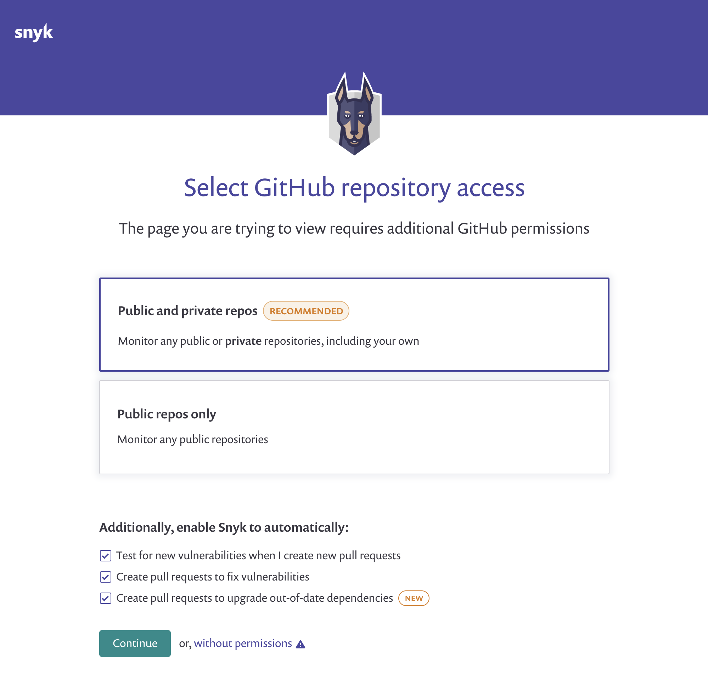
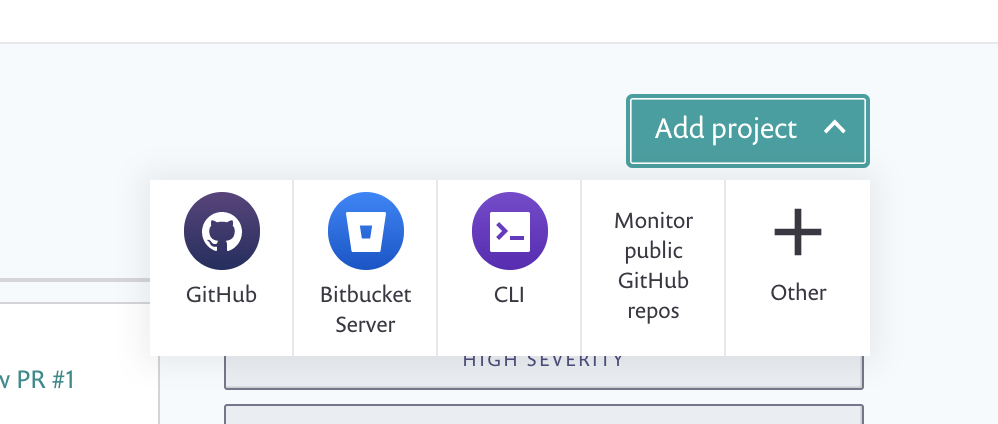

# GitHub Read-Only Projects

Snyk offers the ability to monitor a public GitHub repository without granting any permissions through your own Snyk account.

## How it works:

This allows you to track the vulnerabilities in a project you are considering using as a dependency, are using as a stand-alone independent tool within your business, or any other public repository where you do not need to actively prevent or fix issues using Snyk's tool.

The repository will be automatically tested daily using Snyk's own GitHub credentials, and tests do not count against any test limits you may have.

As public projects imported in this way are not considered to be "yours", they do not appear in [Snyk's Reports section](https://app.snyk.io/reports).

Unlike projects imported through the Snyk GitHub integration, projects imported/monitored in this way are not eligible for:

* Automatic retesting when a pull request is merged
* Commit tests on any PR raised, to detect \(and optionally block\) new vulnerabilities from being introduced
* Automated fix PRs to recommend minimal changes to fix vulnerabilities - find out more
* Automated dependency upgrade PRs, to keep dependencies up to date and help avoid new vulnerabilities and simplify fixing those that are found.
* Manual Fix PRs generated through Snyk to address specific issues chosen by the user

Projects can be imported in this way both [during onboarding](github-read-only-projects.md), or [post-onboarding to Snyk](github-read-only-projects.md) \(during normal ongoing use\).

## During onboarding to Snyk:

During onboarding, selecting GitHub as the source from which to import projects allows you to set up the full GitHub integration \(and take advantage of the vulnerability prevention and fix functionality available\), or opt to proceed without granting Snyk permissions via the link at the bottom.

Enter a repository to monitor, in the format of "owner/repository":

When a valid repository name is entered, click "+ Add repo", and the repo will be quickly tested for a supported manifest file.

Enter as many repositories as needed, and click "Import X repository/ies".

## Post-onboarding

Read only projects can be imported regardless of whether full GitHub integration is set up, as they do not rely on your GitHub permissions to do so.

This can be done via the "Add projects" dropdown on the dashboard, or by going to [https://app.snyk.io/add/github-readonly](https://app.snyk.io/add/github-readonly).

Enter a repository to monitor, in the format of "owner/repository":

When a valid repository name is entered, click "+ Add repo", and the repo will be quickly tested for a supported manifest file.

Enter as many repositories as needed, and click "Import X repository/ies".

