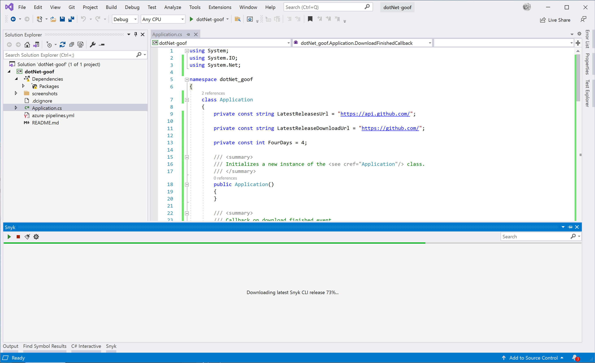
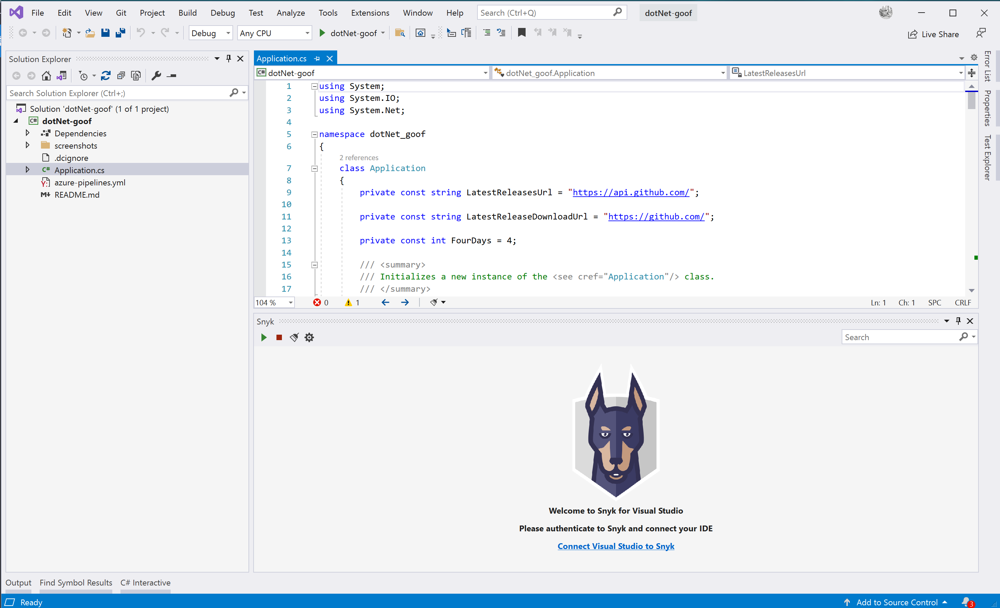
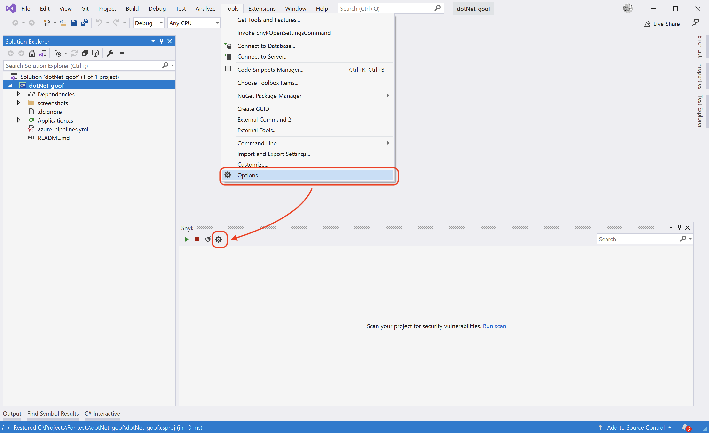
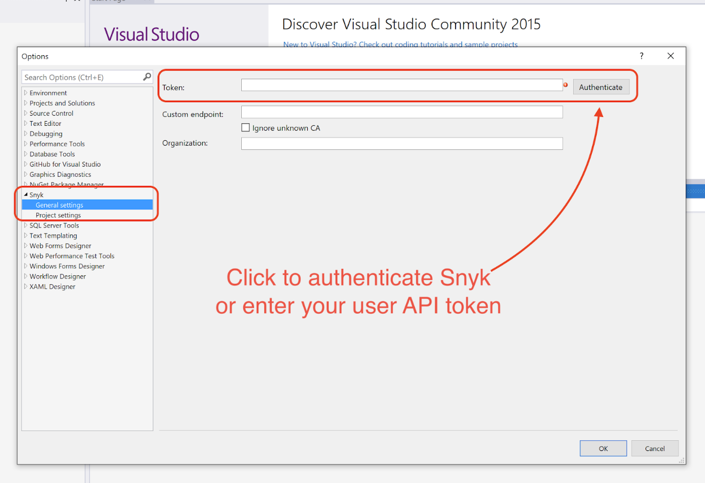
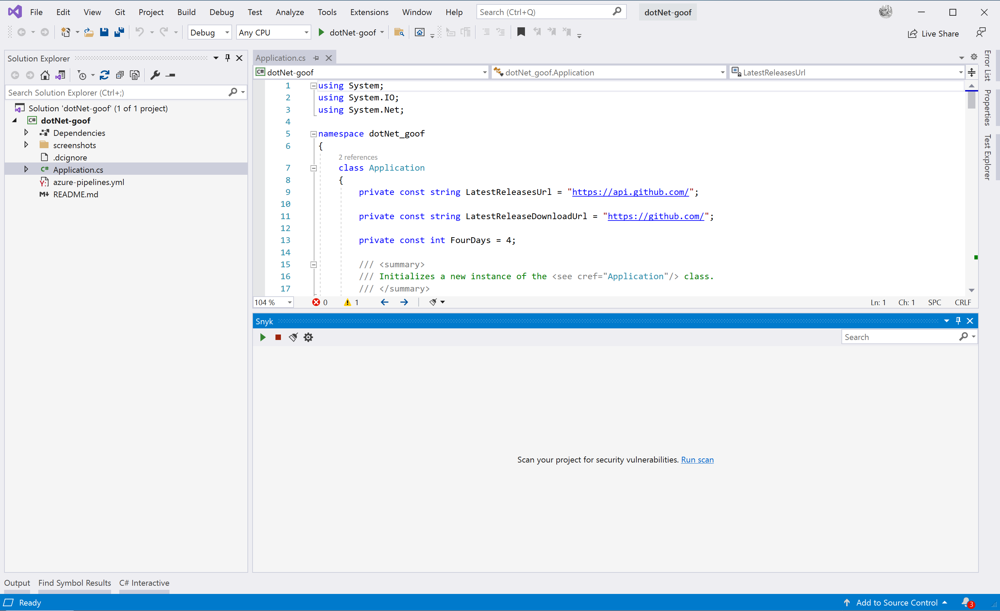
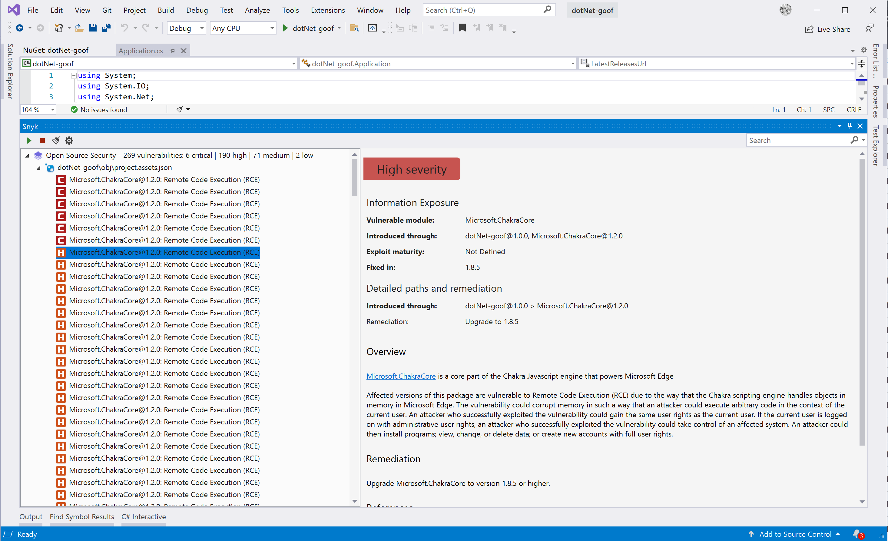
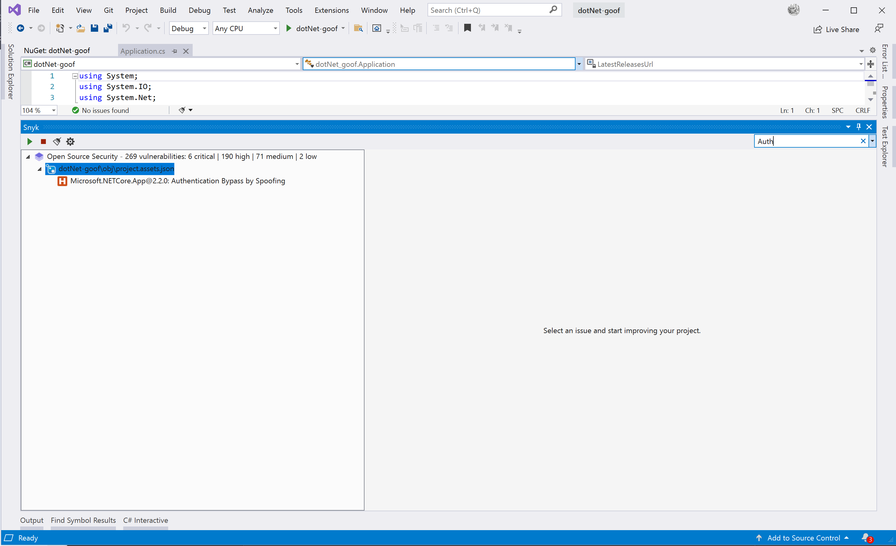
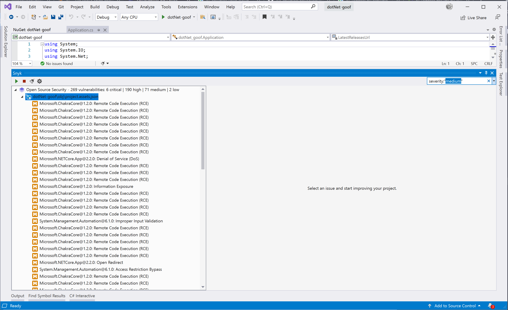

# Visual Studio extension

The Visual Studio extension \(Snyk’s Vulnerability Scanner\) helps you find and fix security vulnerabilities in your projects. Within a few seconds, the extension will provide a list of all the different types of security vulnerabilities identified together with actionable fix advice. Using the engine behind Snyk Open Source Security, we find known vulnerabilities in both the direct and in-direct \(transitive\) open source dependencies you are pulling into the project.


A Visual Studio Code extension is also available for Snyk Code. See [Visual Studio Code extension](visual-studio-code-extension-for-snyk-code.md).


## Introduction

Use this documentation to get started with the Visual Studio extension for [Snyk Open Source](https://snyk.io/product/open-source-security-management/).

## Software requirements

* Operating system - Windows.
* Supported versions of Visual Studio: 2015, 2017, 2019. Compatible with Community, Professional and Enterprise.

## Supported languages

Currently supported languages for Snyk Open Source are C\#, JavaScript, TypeScript, Java, Go, Ruby, Python, PHP, Scala, Swift, Objective-C. See [Snyk Open Source language and framework support](https://docs.snyk.io/snyk-open-source/language-and-package-manager-support).

## Install the extension

The Snyk extension can be installed directly from IDE. To install it open _Extensions &gt; Manage Extensions_ menu.


Search for _Snyk_ and **Download** to download the Snyk extension_._


Once installed, open the Snyk tool window by going to _View &gt; Other Windows_ as shown in the screenshot below.


Once the tool window appears, wait while Snyk extension downloads the latest Snyk CLI version.



By now you should have the extension installed and the Snyk CLI downloaded. Time to authenticate. The first way is to click "Connect Visual Studio to Snyk" link.

## **Authentication**

Authenticate using _"Connect Visual Studio to Snyk"_ link on Overview page.



Or authenticate via Options. Open Visual Studio _Options_ and go to the _General Settings_ of the Snyk extension or use _Settings_ button in toolbar.



Authentication can be triggered by pressing the “Authenticate” button. If for some reason the automated way doesn’t work or input user API token by hand.

If, however, the automated authentication doesn’t work for some reason, please reach out to us. We would be happy to investigate!




You will be taken to the website to verify your identity and connect the IDE extension. Click the **Authenticate** button.


Once the authentication has been confirmed, please feel free to close the browser and go back to the IDE extension. The Token field should have been populated with the authentication token. With that the authentication part should be done!


## Run analysis

* Thank you for installing Snyk’s Visual Studio Extension! By now it should be fully installed. If you have any questions or you feel something is not as it should be, please don’t hesitate to reach out us.
* Let’s now see how to use the extension \(continues on the next page\).

Open your solution and run Snyk scan. Depending on the size of your solution, time to build a dependency graph, it might take from less than a minute to a couple of minutes to get the vulnerabilities.

* Note that your solution will have to successfully build in order to allow the CLI to pick up the dependencies \(and find the vulnerabilities\).
* If you see only NPM vulnerabilities or vulnerabilities that are not related to your C\#/.NET projects, that might mean your project is not built successfully and wasn’t detected by the CLI. Feel free to reach out to us \(contacts at the end of the document\) if you think something is not as expected, we are happy to help or clarify something for you.





## View analysis results

You could filter vulnerabilities by name or by severity.

* Filter by name by typing the name of the vulnerability in the search bar.



* Filter by severity by selecting one or more of the the severities when you open the search bar filter.



Users could configure Snyk extension by _Project settings_.

* Note that the “Scan all projects” option is enabled by default. It adds --all-projects option for Snyk CLI. This option scans all projects by default.


## Extension configuration

After the plugin is installed, you can set the following configurations for the extension:

* **Token**: the token the extension uses to connect to Snyk. You can manually replace it, if you need to switch to another account.
* **Custom endpoint**: Custom Snyk API endpoint for your organization.
* **Ignore unknown CA**: Ignore unknown certificate authorities.
* **Organization**: Specify the ORG\_NAME to run Snyk commands tied to a specific organization.
* **Send usage analytics**: To help us improve the extension, you can let your Visual Studio send us information about how it’s working.
* **Project settings**: Specify any additional Snyk CLI parameters.
* **Scan all projects**: Auto-detect all projects in the working directory. It's enabled by default.

## Known caveats

## Could not detect supported target files

**Solution** Open Visual Studio Options to go to the Project Settings of the Snyk extension and check Scan all projects.


## How to

## How to find the log files

Run Visual Studio with ‘/log’ parameter and path where do you want to save log file.

```text
devenv /log "%DIRECTORY_PATH%\MyVSLog.xml"
```

As an example, for Visual Studio 2019 it could be

```text
C:\Program Files (x86)\Microsoft Visual Studio\2019\Community\Common7\IDE\devenv.exe /log "C:\Temp\MyVSLog.xml"
```

## Build process

Close this repository to local machine:

```text
git clone https://github.com/snyk/snyk-visual-studio-plugin.git
```

Restore Nuget packages:

```text
nuget restore
```

Run build:

```text
msbuild -t:Build
```

## Contacts

* If you have any issues please reach out to [support@snyk.io](mailto:support@snyk.io).

## Conclusion

Thank you for reaching that far :\)

It either means you’ve successfully run a scan with the Visual Studio extension or you’ve encountered an issue. Either way we would love to hear about it - so go ahead and use the above contacts. We are looking forward to hearing from you!

## Useful links

* This plugin works with projects written in .NET, Java, JavaScript, and many more languages. [See the full list of languages and package managers Snyk supports](https://support.snyk.io/hc/en-us/sections/360001087857-Language-package-manager-support)
* [Bug tracker](https://github.com/snyk/snyk-visual-studio-plugin/issues)
* [Github repository](https://github.com/snyk/snyk-visual-studio-plugin)

