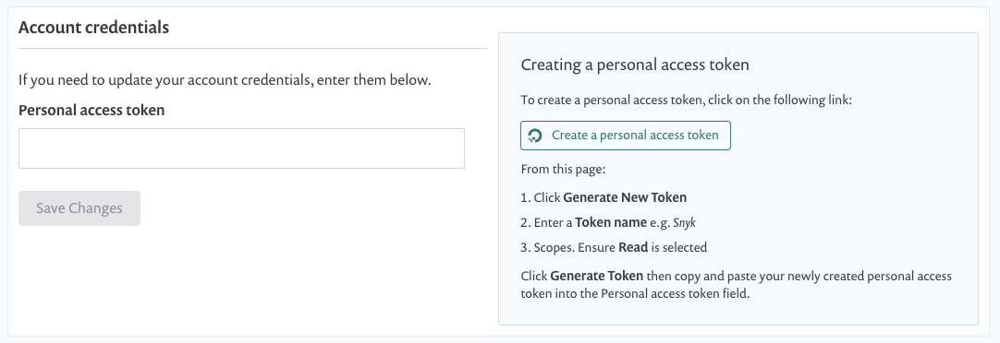

# Container security with DigitalOcean integration

Snyk integrates with DigitalOcean to enable you to import your container images and monitor them for vulnerabilities.

Snyk tests the images you’ve imported \(referred to as \`projects\`\) for any known security vulnerabilities, testing them at a frequency you control and alerts you when new issues are detected.

Integration with DigitalOcean is available for all Snyk users.

To set up DigitalOcean integration in Snyk and start managing image vulnerabilities:

Prerequisites

* You must be an administrator for the organization you're configuring in Snyk.
* Snyk needs user credentials to integrate with DigitalOcean and does not support DigitalOcean when configured for single sign-on \(SSO\).

**Configure integration**

1. In your Snyk account, navigate to Integrations from the menu bar at the top. Under the Container Registries section, find the **DigitalOcean** option and click it.
2. In the **Account credentials** section, enter your DigitalOcean personal access token as the login credential. Detailed instructions to create the access token can be found in the integration page. To finish, click **Save**.

In case you are using a self-hosted DigitalOcean, contact us to provide you with a token. You can read more about setting up private registry integration [here](https://docs.snyk.io/snyk-container/integrate-self-hosted-container-registries/snyk-integration-to-self-hosted-container-registries).


**Note**  
For the connection to succeed, make sure you have a repository in DigitalOcean.


Snyk tests the connection values and the page reloads, now displaying DigitalOcean integration information, and the **Add your DigitalOcean images to Snyk** button becomes available. In case the connection to DigitalOcean failed, notification appears under the **Connected to DigitalOcean** section.  
Now you can use Snyk to scan your images from DigitalOcean.

